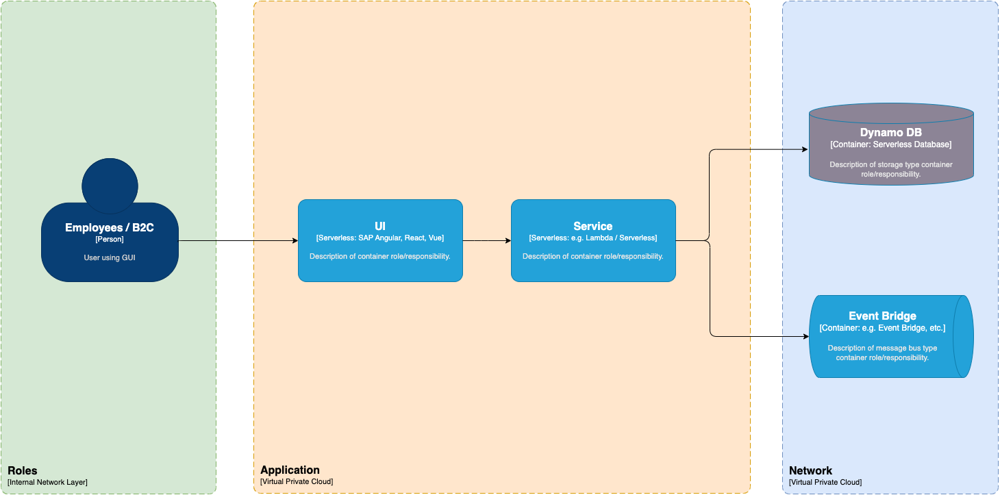
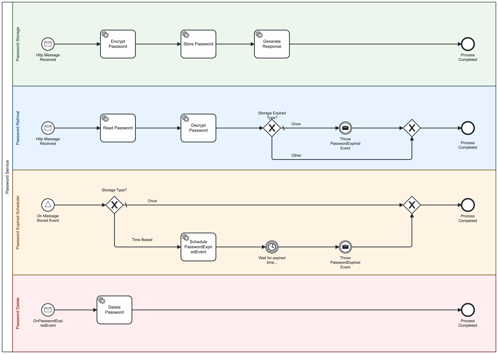

# Secure Password Exchange

## 1. Introduction and Goals

### 1.1 Requirements Overview
- **Customer Requirement**: Secure way for employees to exchange passwords.
- **Key Requirement**: Application accessible only from the customer's private network.
- **Technology**: Yopass-like solution using AWS tools.

### 1.2 Quality Goals
- **Security**: High priority on secure data exchange and storage.
- **Usability**: Ease of use for end-users.
- **Maintainability**: Easy to update and maintain the system.

## 2. Constraints
- **Security Constraints**: Application must operate within a private network.
- **Technology Constraints**: Must use AWS tools.
- **Compliance Constraints**: Follow GDPR guidelines for data security and privacy.

## 3. Context and Scope

### 3.1 Business Context
- **Customer**: Company requiring secure password exchange among employees.
- **Stakeholders**: IT department, Security team, End-users.

### 3.2 Technical Context
- **External Systems**: Internal network, authentication systems.
- **Interfaces**: API Gateway, VPC.

## 4. Solution Strategy

### 4.1 Overall Solution Approach

The overall solution leverages AWS serverless architecture to create a secure, scalable, and maintainable application for password exchange among employees. 
The architecture is designed to ensure high security, ease of use, and efficient management of passwords, integrating several AWS services to achieve these goals.

### 4.2 Key Architectural Decisions

1. **Use of Serverless Architecture**:
    - **Reason**: Serverless architecture allows automatic scaling, reduces operational overhead, and aligns costs with actual usage.
    - **Components**: AWS Lambda for processing, Amazon API Gateway for managing API requests, and Amazon S3 for static content hosting.

2. **Isolated Network Environment**:
    - **Reason**: Ensures that the application is only accessible within the customer's private network, enhancing security.
    - **Components**: AWS Virtual Private Cloud (VPC) to isolate the network and control access.

3. **Authentication and Authorization**:
    - **Reason**: Secure user access and authorization are critical for sensitive operations like password management.
    - **Components**: Amazon Cognito for user authentication and AWS IAM for access control.

4. **Data Encryption**:
    - **Reason**: Protect sensitive password data both at rest and in transit.
    - **Components**: AWS Key Management Service (KMS) for encryption keys, and HTTPS for secure data transmission.

5. **Event-Driven Processing**:
    - **Reason**: Automates actions based on specific events, such as password expiration.
    - **Components**: AWS EventBridge to manage event-driven workflows and triggers.

6. **Monitoring and Logging**:
    - **Reason**: Provides visibility into system operations, helps in troubleshooting, and ensures compliance.
    - **Components**: Amazon CloudWatch for logging and monitoring.

### 4.3 Key Solution Elements

**User Interface**:
- **Amazon S3**: Hosts static web content for the application interface.
- **Route S3**: Manages routing to the static content.

**API Management**:
- **Amazon API Gateway**: Manages all API requests, ensuring secure and efficient communication between the user and backend services.
- **API Key and IAM Policy**: Ensure secure access to the APIs, limiting usage to authorized users.

**Password Management**:
- **AWS Lambda Functions**:
    - **Store Password**: Encrypts and stores passwords in the NoSQL database.
    - **Read Password**: Decrypts and retrieves passwords from the NoSQL database.
    - **Delete Password**: Removes expired passwords from the NoSQL database.

**Database**:
- **NoSQL Database**: Securely stores encrypted password entries, ensuring data integrity and availability.

**Event Handling**:
- **AWS EventBridge**:
    - Manages password lifecycle events such as storage, retrieval, and expiration.
    - Automates workflows based on event triggers to handle password expiration and deletion.

**Security and Access Control**:
- **Amazon Cognito**: Manages user authentication, providing secure access tokens for API usage.
- **AWS IAM Roles**: Define permissions and roles for accessing different AWS resources securely.

**Monitoring and Logging**:
- **Amazon CloudWatch**: Collects and analyzes logs, monitors system performance, and triggers alerts for any issues.

### Implementation Details

1. **User Access**:
    - Users interact with the application via a web interface hosted on Amazon S3.
    - Actions such as storing, retrieving, and deleting passwords are initiated through API requests managed by Amazon API Gateway.

2. **Processing Logic**:
    - API Gateway routes requests to AWS Lambda functions.
    - Lambda functions handle the core logic for encrypting, decrypting, and storing passwords in the NoSQL database.

3. **Data Security**:
    - Passwords are encrypted using AWS KMS before storage.
    - Encrypted passwords are stored in the NoSQL database, ensuring they remain secure at rest.

4. **Event Management**:
    - AWS EventBridge listens for specific events (e.g., password stored, read, expired) and triggers appropriate actions.
    - Events such as password expiration are scheduled and handled automatically.

5. **Monitoring and Compliance**:
    - All actions and events are logged in Amazon CloudWatch.
    - CloudWatch provides monitoring dashboards and sets up alerts to notify administrators of any anomalies.

## 5. Building Block View

### 5.1 Whitebox Overall System

**System Context:**
The system is designed to provide a secure method for exchanging passwords among employees, leveraging AWS serverless architecture. The application is accessible only within the customer's private network.

**Key Components:**
1. **User**: The end-user accessing the application.
2. **Route S3**: Manages routing for static content.
3. **Amazon S3**: Stores static web content.
4. **Hosted Zone**: Manages DNS settings for the application.
5. **API Gateway**: Exposes RESTful API endpoints for interacting with the application.
6. **Cognito Identity**: Manages authentication and authorization for users.
7. **Lambda Functions**:
  - **Store Password**: Handles storing of passwords.
  - **Read Password**: Handles retrieval of passwords.
  - **Delete Password**: Handles deletion of passwords.
8. **NoSQL DB**: Stores password data securely.
9. **EventBridge**: Manages event-driven processing for password expiration and deletion.
10. **CloudWatch Logs**: Monitors and logs application activity.

### 5.2 Level 2: Container Diagram

**Containers:**
1. **User Interface**:
  - **User**: Interacts with the application via web interface hosted on Amazon S3.
  - **HTML/HTTP**: Protocols used to access the web content.

2. **Routing and API Management**:
  - **Route S3**: Directs users to the correct web resources.
  - **API Gateway**: Manages API calls from the user, providing endpoints for storing, reading, and deleting passwords.
  - **API Key**: Secures API access.
  - **IAM Policy**: Defines permissions for API access.

3. **Authentication**:
  - **Cognito Identity**: Authenticates users and grants access tokens for API usage.

4. **Password Management**:
  - **Store Password (Lambda)**: A function that processes POST requests to store encrypted passwords in NoSQL DB.
  - **Read Password (Lambda)**: A function that processes GET requests to retrieve encrypted passwords from NoSQL DB.
  - **Delete Password (Lambda)**: A function that processes DELETE requests to remove passwords from NoSQL DB.

5. **Database**:
  - **NoSQL DB**: Stores password entries, ensuring data integrity and security.

6. **Event Handling**:
  - **EventBridge**: Triggers events based on password storage, read, and deletion actions.
  - **Triggers**:
    - **On Stored Event**: Schedules expiration events.
    - **On Read Event**: Fires expiration events.
    - **On Delete Event**: Calls delete triggers.

7. **Logging and Monitoring**:
  - **CloudWatch Logs**: Collects logs from various AWS services and monitors application performance and security.

8. **Permissions and Security**:
  - **IAM Roles**: Assigns permissions to Lambda functions and other services.

### 5.3 Level 3: Detailed Design

**Detailed Interaction and Processes:**
1. **User Interaction**:
  - User accesses the web application via a browser. The content is served from an S3 bucket.
  - User actions (store, read passwords) trigger API calls via the API Gateway.

2. **API Gateway**:
  - Receives user requests and routes them to the appropriate Lambda function.
  - Uses API Keys and IAM policies to ensure secure access.

3. **Lambda Functions**:
  - **Store Password**: Encrypts and stores the password in the NoSQL DB.
  - **Read Password**: Retrieves and decrypts the password from the NoSQL DB.
  - **Delete Password**: Removes the password entry from the NoSQL DB.

4. **Database Operations**:
  - NoSQL DB operations are handled by the Lambda functions.
  - Database events trigger further actions via EventBridge.

5. **EventBridge**:
  - Manages lifecycle events such as password expiration and deletion.
  - Uses triggers to automate workflows based on database events.

6. **Logging and Monitoring**:
  - All activities and errors are logged to CloudWatch Logs for monitoring and troubleshooting.

7. **Security**:
  - IAM roles and policies ensure that only authorized actions are performed by the Lambda functions.
  - Cognito Identity provides secure user authentication and authorization.

### Diagram Summary

This diagram illustrates the serverless architecture of the secure password exchange application, highlighting the interaction between users, API Gateway, Lambda functions, and other AWS services. 
It showcases how each component fits into the overall system to ensure security, scalability, and maintainability.

## 6. Runtime View

### 6.1 Runtime Scenarios

**Password Storage Process:**

1. **HTTP Message Received**:
  - **Trigger**: User sends a request to store a password.
  - **Action**: The system receives the HTTP message containing the password data.

2. **Encrypt Password**:
  - **Trigger**: Receipt of the HTTP message.
  - **Action**: The system encrypts the password using a secure encryption algorithm.

3. **Store Password**:
  - **Trigger**: Completion of password encryption.
  - **Action**: The encrypted password is stored in the NoSQL database.

4. **Generate Response**:
  - **Trigger**: Successful storage of the encrypted password.
  - **Action**: The system generates a response to the user indicating successful storage.

5. **Process Completed**:
  - **Outcome**: The password storage process is completed.

**Password Retrieval Process:**

1. **HTTP Message Received**:
  - **Trigger**: User sends a request to retrieve a password.
  - **Action**: The system receives the HTTP message requesting password retrieval.

2. **Read Password**:
  - **Trigger**: Receipt of the HTTP message.
  - **Action**: The system reads the encrypted password from the NoSQL database.

3. **Decrypt Password**:
  - **Trigger**: Successful retrieval of the encrypted password.
  - **Action**: The system decrypts the password.

4. **Decision Point (Storage Expired Type?)**:
  - **Trigger**: After decrypting the password.
  - **Action**: The system checks if the password storage is of type "Once" or "Other".

5. **Throw PasswordExpired Event**:
  - **Trigger**: If the password storage type is "Once".
  - **Action**: The system triggers a PasswordExpired event.

6. **Process Completed**:
  - **Outcome**: The password retrieval process is completed.

**Password Expired Scheduler Process:**

1. **On Message Stored Event**:
  - **Trigger**: A password is stored in the system.
  - **Action**: The system receives a message indicating a stored password event.

2. **Decision Point (Storage Type?)**:
  - **Trigger**: Upon receiving the stored event message.
  - **Action**: The system determines if the storage type is "Once" or "Time Based".

3. **Schedule PasswordExpiredEvent**:
  - **Trigger**: If the storage type is "Time Based".
  - **Action**: The system schedules a PasswordExpired event based on the specified expiration time.

4. **Wait for expired time**:
  - **Trigger**: After scheduling the PasswordExpired event.
  - **Action**: The system waits until the expiration time is reached.

5. **Throw PasswordExpired Event**:
  - **Trigger**: When the expiration time is reached.
  - **Action**: The system triggers a PasswordExpired event.

6. **Process Completed**:
  - **Outcome**: The password expired scheduler process is completed.

**Password Delete Process:**

1. **On PasswordExpired Event**:
  - **Trigger**: A PasswordExpired event is triggered.
  - **Action**: The system receives a message indicating a PasswordExpired event.

2. **Delete Password**:
  - **Trigger**: Receipt of the PasswordExpired event.
  - **Action**: The system deletes the expired password from the NoSQL database.

3. **Process Completed**:
  - **Outcome**: The password delete process is completed.

## 7. Deployment View

### 7.1 Infrastructure Level

The deployment view describes the environment in which the application is deployed, including the hardware and software infrastructure required to support the system.

#### Key Components

1. **AWS Virtual Private Cloud (VPC)**:
    - **Purpose**: Provides an isolated network environment to ensure the application is only accessible within the customer's private network.
    - **Subnets**: Divides the VPC into multiple subnets for isolating resources.

2. **Amazon S3**:
    - **Purpose**: Hosts the static web content for the application interface.
    - **Deployment**: The web content is deployed to an S3 bucket and configured for static website hosting.

3. **Amazon API Gateway**:
    - **Purpose**: Manages all API requests to the backend services.
    - **Deployment**: Configured with routes to the Lambda functions for handling user requests.

4. **AWS Lambda Functions**:
    - **Purpose**: Handles the core logic for password management.
    - **Deployment**: Deployed within the VPC, with specific roles and permissions to access other AWS services.
        - **Functions**:
            - Store Password
            - Read Password
            - Delete Password

5. **Amazon DynamoDB (NoSQL Database)**:
    - **Purpose**: Stores encrypted password entries securely.
    - **Deployment**: Configured within the VPC for secure access.

6. **AWS EventBridge**:
    - **Purpose**: Manages event-driven workflows and triggers based on password lifecycle events.
    - **Deployment**: Integrated with Lambda functions and other services for handling events.

7. **Amazon Cognito**:
    - **Purpose**: Manages user authentication and authorization.
    - **Deployment**: Configured to provide secure access tokens for API requests.

8. **Amazon CloudWatch**:
    - **Purpose**: Monitors and logs application activity.
    - **Deployment**: Configured to collect logs and metrics from Lambda functions and other AWS services.

9. **IAM Roles and Policies**:
    - **Purpose**: Ensures secure access and permissions for AWS resources.
    - **Deployment**: Configured with least privilege access to secure the application.

### 7.2 Deployment Diagram

The deployment diagram below illustrates the deployment architecture of the application, highlighting the interaction between various AWS components.

### 7.3 Deployment Steps

1. **Setup VPC**:
    - Create a new VPC.
    - Define subnets within the VPC for different components.
    - Configure routing tables and internet gateways as necessary.

2. **Deploy S3 Bucket**:
    - Create an S3 bucket for static web hosting.
    - Upload the web content to the bucket.
    - Configure the bucket for static website hosting.

3. **Configure API Gateway**:
    - Create a new API Gateway.
    - Define routes for handling user requests (store, read, delete passwords).
    - Integrate routes with respective Lambda functions.

4. **Deploy Lambda Functions**:
    - Create Lambda functions for storing, reading, and deleting passwords.
    - Assign appropriate IAM roles and policies.
    - Configure VPC access for the Lambda functions.

5. **Setup DynamoDB**:
    - Create a DynamoDB table for storing encrypted passwords.
    - Configure access permissions for the Lambda functions.

6. **Configure EventBridge**:
    - Create event rules for managing password lifecycle events.
    - Integrate EventBridge with Lambda functions to handle events.

7. **Setup Cognito**:
    - Create a new Cognito user pool.
    - Configure user authentication and authorization.
    - Integrate Cognito with API Gateway for secure access.

8. **Configure CloudWatch**:
    - Set up CloudWatch log groups and metrics.
    - Configure Lambda functions to send logs to CloudWatch.
    - Create alarms and dashboards for monitoring.

9. **Apply IAM Roles and Policies**:
    - Define IAM roles for each AWS service.
    - Assign policies with least privilege access.
    - Ensure secure cross-service access.

## 8. Cross-cutting Concepts

Cross-cutting concepts represent the overall concerns and common aspects that influence multiple parts of the system. They include aspects like security, performance, logging, error handling, and more.

### 8.1 Security

**Authentication and Authorization**:
- **Amazon Cognito** is used for managing user authentication and providing secure access tokens for API requests.
- **AWS IAM Roles and Policies** ensure that only authorized users and services can access specific resources. Policies follow the principle of least privilege.

**Data Encryption**:
- **AWS Key Management Service (KMS)** is used for managing encryption keys.
- **Data at Rest**: Passwords are encrypted before being stored in the NoSQL database (Amazon DynamoDB).
- **Data in Transit**: All communication between the client and the server is encrypted using HTTPS.

**Network Security**:
- **AWS Virtual Private Cloud (VPC)** provides an isolated network environment to ensure the application is only accessible within the customer's private network.
- **Subnets and Security Groups** are configured to isolate and control access to resources within the VPC.

### 8.2 Performance

**Scalability**:
- **AWS Lambda** provides automatic scaling based on the number of incoming requests, ensuring that the application can handle varying loads efficiently.
- **Amazon DynamoDB** is used for its ability to scale automatically and handle large amounts of data with low latency.

**Caching**:
- Consider implementing caching mechanisms for frequently accessed data to reduce latency and improve response times.

### 8.3 Monitoring and Logging

**Monitoring**:
- **Amazon CloudWatch** is configured to collect logs, metrics, and events from AWS services.
- **CloudWatch Alarms** notify administrators of any issues or anomalies, allowing for quick response and resolution.

**Logging**:
- **Lambda Functions**: Each function is configured to send logs to CloudWatch Logs, providing visibility into function execution and errors.
- **API Gateway**: Logs all API requests and responses, including any errors, to CloudWatch Logs.

### 8.4 Error Handling

**Lambda Functions**:
- Implement robust error handling within Lambda functions to catch and log errors, ensuring that any issues are recorded and can be addressed.
- Use **AWS Step Functions** to orchestrate complex workflows and handle retries and error states gracefully.

**API Gateway**:
- Configure **Custom Error Responses** to provide meaningful feedback to users in case of errors.

### 8.5 Compliance

**Data Protection**:
- Ensure compliance with data protection regulations such as GDPR by implementing strong encryption, access controls, and audit logging.
- Regularly review and update IAM policies to ensure they meet compliance requirements.

**Auditing**:
- **CloudTrail** can be used to log and monitor all API calls made within the AWS environment, providing an audit trail for compliance and security purposes.

### 8.6 Operational Concerns

**Deployment**:
- Use **Infrastructure as Code (IaC)** tools like AWS CloudFormation or Terraform to automate the deployment and management of AWS resources.
- Implement CI/CD pipelines to streamline the deployment process and ensure consistent and reliable releases.

**Backup and Recovery**:
- Regularly back up data stored in DynamoDB and S3 to ensure that data can be recovered in case of failure.
- Implement disaster recovery plans to ensure business continuity.

### 8.7 User Experience

**Usability**:
- Host the web interface on **Amazon S3** for reliable and scalable static website hosting.
- Ensure the web interface is user-friendly and provides clear feedback for user actions.

**Accessibility**:
- Follow best practices for web accessibility to ensure the application is usable by a wide range of users, including those with disabilities.

## 9. Design Decisions

The design decisions documented here outline the key choices made during the design and implementation of the secure password exchange application, based on the Building Block View.

### 9.1 Use of AWS Serverless Architecture

**Decision**: Adopt AWS serverless services for the core application components.

**Reason**: Serverless architecture offers automatic scaling, reduced operational overhead, and cost efficiency by aligning costs with actual usage.

**Implications**:
- No need to manage server infrastructure.
- Potential cold start latency for AWS Lambda functions.
- Pay-per-use pricing model.

### 9.2 Isolated Network Environment

**Decision**: Deploy the application within an AWS Virtual Private Cloud (VPC).

**Reason**: Ensures the application is only accessible within the customer’s private network, enhancing security.

**Implications**:
- Additional configuration required for VPC, subnets, and security groups.
- Control over network traffic and resource access within the VPC.

### 9.3 User Authentication and Authorization

**Decision**: Use Amazon Cognito for managing user authentication and AWS IAM for access control.

**Reason**: Provides secure and scalable authentication and authorization mechanisms.

**Implications**:
- Simplified user management and authentication flows.
- Fine-grained access control using IAM policies.

### 9.4 Data Encryption

**Decision**: Implement data encryption at rest and in transit using AWS KMS and HTTPS.

**Reason**: Protect sensitive password data from unauthorized access.

**Implications**:
- Increased security for stored and transmitted data.
- Additional configuration for managing encryption keys with AWS KMS.

### 9.5 Event-Driven Processing

**Decision**: Use AWS EventBridge for managing event-driven workflows.

**Reason**: Automates actions based on specific events, such as password expiration.

**Implications**:
- Simplified event handling and integration with other AWS services.
- Potential complexity in managing event rules and targets.

### 9.6 Monitoring and Logging

**Decision**: Utilize Amazon CloudWatch for monitoring and logging application activities.

**Reason**: Provides visibility into system operations, aids in troubleshooting, and ensures compliance.

**Implications**:
- Centralized logging and monitoring.
- Potential additional costs for storing and analyzing logs.

### 9.7 Database Choice

**Decision**: Use Amazon DynamoDB as the NoSQL database for storing encrypted passwords.

**Reason**: DynamoDB offers high availability, scalability, and low latency for handling large amounts of data.

**Implications**:
- NoSQL data model and query limitations.
- Cost considerations based on read/write capacity units and storage.

### 9.8 Static Web Hosting

**Decision**: Host the web interface on Amazon S3 with static website hosting.

**Reason**: S3 provides a reliable, scalable, and cost-effective solution for hosting static web content.

**Implications**:
- No need for server management for hosting web content.
- Simplified deployment and scaling of web interface.

### 9.9 API Management

**Decision**: Use Amazon API Gateway to manage API requests to the backend services.

**Reason**: Provides a secure and scalable solution for exposing API endpoints and managing API traffic.

**Implications**:
- Simplified API management and security.
- Potential cost based on the number of API calls.

### 9.10 IAM Roles and Policies

**Decision**: Implement fine-grained access control using AWS IAM roles and policies.

**Reason**: Ensures secure access to AWS resources, following the principle of least privilege.

**Implications**:
- Requires careful planning and management of IAM policies.
- Enhanced security through controlled access permissions.

### Conclusion

The design decisions outlined above provide a comprehensive overview of the key choices made during the design and implementation of the secure password exchange application. These decisions ensure that the solution is secure, scalable, and maintainable, meeting the customer’s requirements effectively.

## 10. Quality Requirements

The quality requirements section outlines the key quality attributes that the secure password exchange application must fulfill. 
These requirements ensure that the system meets the necessary standards for performance, security, usability, and maintainability.

### 10.1 Quality Tree

**Security**
- **Authentication and Authorization**: Use Amazon Cognito for managing user authentication and AWS IAM for access control to ensure that only authorized users can access the system.
- **Data Encryption**: Implement data encryption at rest and in transit using AWS KMS and HTTPS to protect sensitive password data from unauthorized access.
- **Network Security**: Deploy the application within an AWS Virtual Private Cloud (VPC) to ensure it is only accessible within the customer’s private network.

**Performance**
- **Scalability**: Use AWS Lambda and Amazon DynamoDB to automatically scale based on demand, ensuring the application can handle varying loads efficiently.
- **Latency**: Optimize API Gateway and Lambda functions to minimize latency and provide a responsive user experience.

**Usability**
- **User Interface**: Host the web interface on Amazon S3 for reliable and scalable static website hosting, ensuring a user-friendly and responsive interface.
- **Accessibility**: Follow best practices for web accessibility to ensure the application is usable by a wide range of users, including those with disabilities.

**Maintainability**
- **Monitoring and Logging**: Utilize Amazon CloudWatch for monitoring and logging application activities to provide visibility into system operations and aid in troubleshooting.
- **Deployment Automation**: Use Infrastructure as Code (IaC) tools like AWS CloudFormation or Terraform to automate the deployment and management of AWS resources, ensuring consistent and reliable releases.

### 10.2 Quality Scenarios

**Scenario 1: Secure Password Storage**
- **Quality Attribute**: Security
- **Description**: When a user stores a password, the system encrypts the password using AWS KMS and stores it in Amazon DynamoDB.
- **Measurement**: All passwords must be encrypted before storage, and encryption keys must be managed securely.

**Scenario 2: High Availability**
- **Quality Attribute**: Performance
- **Description**: The system must handle a large number of concurrent users storing and retrieving passwords without performance degradation.
- **Measurement**: The system should scale automatically to handle at least 10,000 concurrent users with response times under 1 second.

**Scenario 3: User Authentication**
- **Quality Attribute**: Security
- **Description**: Users must authenticate using Amazon Cognito before accessing the system to store or retrieve passwords.
- **Measurement**: 100% of access requests must be authenticated and authorized.

**Scenario 4: Error Handling and Logging**
- **Quality Attribute**: Maintainability
- **Description**: The system must log all errors and provide meaningful error messages to users.
- **Measurement**: 100% of errors are logged in CloudWatch, and user-facing error messages should be clear and actionable.

**Scenario 5: Usability of the Web Interface**
- **Quality Attribute**: Usability
- **Description**: The web interface must be responsive and easy to use for storing and retrieving passwords.
- **Measurement**: User satisfaction ratings should average 4 out of 5 or higher in usability tests.

**Scenario 6: Compliance with Data Protection Regulations**
- **Quality Attribute**: Security, Compliance
- **Description**: The system must comply with data protection regulations such as GDPR.
- **Measurement**: Regular audits must show 100% compliance with relevant data protection regulations.

## 11. Risks and Technical Debt

The risks and technical debt section identifies potential risks associated with the secure password exchange application and the areas where technical debt may accumulate. Addressing these risks and managing technical debt is crucial for maintaining the system’s long-term reliability and performance.

### 11.1 Identified Risks

**Risk 1: Data Breach**
- **Description**: Unauthorized access to sensitive password data.
- **Impact**: High – Could result in compromised security and loss of trust.
- **Mitigation**: Use AWS IAM for fine-grained access control, encrypt data at rest and in transit using AWS KMS and HTTPS, and regularly audit access logs.

**Risk 2: Service Downtime**
- **Description**: Outages or downtime of AWS services impacting application availability.
- **Impact**: Medium – May affect user access and trust in the system.
- **Mitigation**: Implement high availability and failover strategies using AWS services, monitor service health with CloudWatch, and prepare a disaster recovery plan.

**Risk 3: Performance Bottlenecks**
- **Description**: Scalability issues or performance bottlenecks under high load.
- **Impact**: Medium – Could degrade user experience and system responsiveness.
- **Mitigation**: Use AWS Lambda for automatic scaling, optimize API Gateway and Lambda functions for performance, and implement caching where appropriate.

**Risk 4: Compliance Violations**
- **Description**: Failure to comply with data protection regulations such as GDPR.
- **Impact**: High – Could result in legal penalties and loss of user trust.
- **Mitigation**: Regularly review and update policies for compliance, conduct audits, and ensure encryption and access controls are properly implemented.

**Risk 5: Complex Event Management**
- **Description**: Difficulty in managing and debugging event-driven workflows.
- **Impact**: Low – Could lead to delays in processing or handling events.
- **Mitigation**: Use AWS EventBridge for managing events, document event flows, and implement logging and monitoring for events.

### 11.2 Technical Debt

**Debt 1: Code Quality and Maintainability**
- **Description**: Accumulation of technical debt due to poor code quality or lack of documentation.
- **Impact**: Medium – Could increase the cost and effort required for maintenance and future enhancements.
- **Management**: Implement code reviews, maintain comprehensive documentation, and follow best practices for clean code and architecture.

**Debt 2: Security Updates and Patching**
- **Description**: Delays in applying security updates and patches to the application and underlying infrastructure.
- **Impact**: High – Could expose the system to vulnerabilities and security threats.
- **Management**: Automate security updates where possible, schedule regular maintenance windows for patching, and monitor security advisories.

**Debt 3: Dependency Management**
- **Description**: Outdated or unmaintained third-party dependencies.
- **Impact**: Medium – Could lead to compatibility issues and security vulnerabilities.
- **Management**: Regularly review and update dependencies, use dependency management tools, and ensure compatibility with the latest versions.

**Debt 4: Monitoring and Logging**
- **Description**: Insufficient monitoring and logging coverage.
- **Impact**: Medium – Could hinder the ability to detect and resolve issues promptly.
- **Management**: Expand monitoring and logging coverage using CloudWatch, set up alerts for critical metrics, and regularly review logs for anomalies.

**Debt 5: Infrastructure as Code (IaC)**
- **Description**: Incomplete or inconsistent implementation of IaC.
- **Impact**: Low – Could lead to configuration drift and difficulties in reproducing environments.
- **Management**: Fully implement IaC using AWS CloudFormation or Terraform, maintain version control for infrastructure code, and regularly review and update IaC scripts.

# Glossary

## Glossary

| Term                  | Description                                                                                                                                                               |
|-----------------------|---------------------------------------------------------------------------------------------------------------------------------------------------------------------------|
| AWS                   | Amazon Web Services, a comprehensive cloud computing platform provided by Amazon.                                                                                         |
| VPC                   | Virtual Private Cloud, a logically isolated section of the AWS cloud where you can launch AWS resources in a virtual network.                                             |
| S3                    | Simple Storage Service, an object storage service that offers industry-leading scalability, data availability, security, and performance.                                 |
| API Gateway           | A managed service that allows developers to create, publish, maintain, monitor, and secure APIs at any scale.                                                             |
| Lambda                | A serverless compute service that runs your code in response to events and automatically manages the underlying compute resources for you.                                |
| DynamoDB              | A key-value and document database that delivers single-digit millisecond performance at any scale.                                                                        |
| Cognito               | Amazon Cognito, a service that makes it easy to add user sign-up, sign-in, and access control to web and mobile apps.                                                     |
| KMS                   | Key Management Service, a managed service that makes it easy to create and control the encryption keys used to encrypt your data.                                         |
| EventBridge           | A serverless event bus service that makes it easy to connect applications using data from your own applications, integrated SaaS applications, and AWS services.          |
| CloudWatch            | A monitoring and observability service built for DevOps engineers, developers, site reliability engineers (SREs), and IT managers.                                        |
| IAM                   | Identity and Access Management, a web service that helps you securely control access to AWS services and resources for your users.                                        |
| IaC                   | Infrastructure as Code, the process of managing and provisioning computing infrastructure through machine-readable definition files.                                      |
| REST API              | Representational State Transfer Application Programming Interface, a set of rules that developers follow when they create their API.                                      |
| JSON                  | JavaScript Object Notation, a lightweight data-interchange format that is easy for humans to read and write, and easy for machines to parse and generate.                 |
| Encryption            | The process of converting information or data into a code, especially to prevent unauthorized access.                                                                     |
| HTTPS                 | HyperText Transfer Protocol Secure, an extension of HTTP for secure communication over a computer network.                                                                |
| CI/CD                 | Continuous Integration and Continuous Deployment/Delivery, a method to frequently deliver apps to customers by introducing automation into the stages of app development. |
| S3 Bucket             | A container for objects stored in Amazon S3.                                                                                                                              |
| Swagger/OpenAPI       | A specification for defining APIs that allows both humans and computers to understand the capabilities of a service without accessing its source code.                    |
| Serverless            | A cloud-computing execution model in which the cloud provider runs the server, and dynamically manages the allocation of machine resources.                               |
| JSON Schema           | A vocabulary that allows you to annotate and validate JSON documents.                                                                                                     |
| API Key               | A code passed in by computer programs calling an API to identify the calling program, its developer, or its user to the website.                                          |

