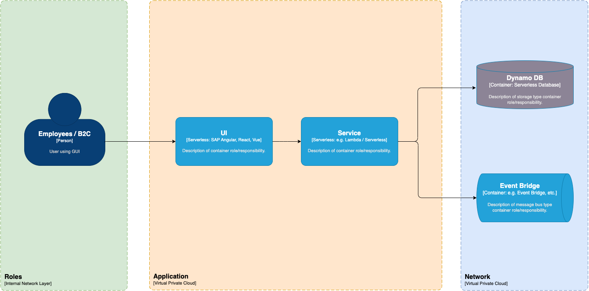

## 3. Context and Scope

### 3.1 Business Context
- **Customer**: Company requiring secure password exchange among employees.
- **Stakeholders**: IT department, Security team, End-users.

### 3.2 Technical Context
- **External Systems**: Internal network, authentication systems.
- **Interfaces**: API Gateway, VPC.