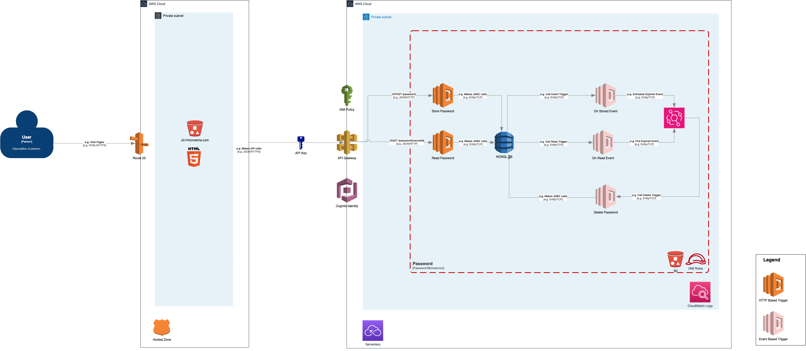

## 5. Building Block View

### 5.1 Whitebox Overall System
- **System Context**: The system is deployed within a VPC, with restricted access through API Gateway.
- **Key Components**:
    - **DynamoDB**: Stores encrypted data.
    - **Lambda**: Executes serverless functions.
    - **CloudWatch**: Monitors and logs activities.

### 5.2 Level 2: Container Diagram
- **DynamoDB**: Stores encrypted files.
- **API Gateway**: Controls access to the application.