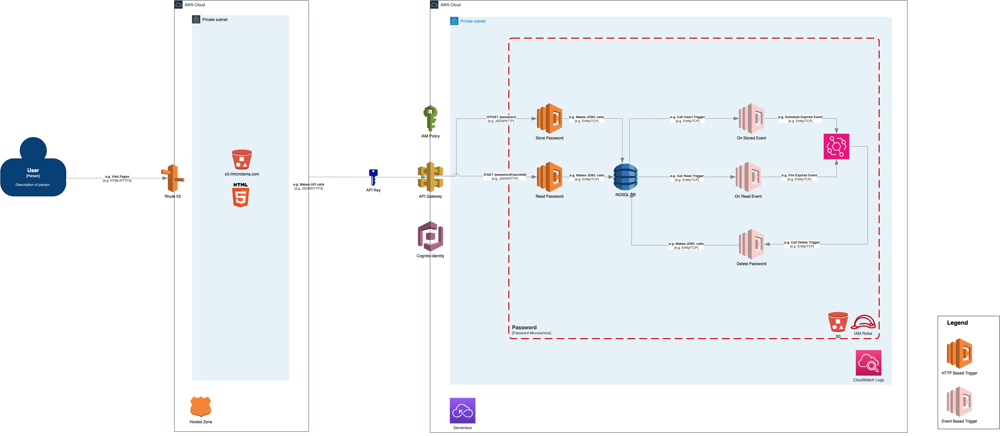

## 7. Deployment View

### 7.1 Infrastructure Level

The deployment view describes the environment in which the application is deployed, including the hardware and software infrastructure required to support the system.

#### Key Components

1. **AWS Virtual Private Cloud (VPC)**:
    - **Purpose**: Provides an isolated network environment to ensure the application is only accessible within the customer's private network.
    - **Subnets**: Divides the VPC into multiple subnets for isolating resources.

2. **Amazon S3**:
    - **Purpose**: Hosts the static web content for the application interface.
    - **Deployment**: The web content is deployed to an S3 bucket and configured for static website hosting.

3. **Amazon API Gateway**:
    - **Purpose**: Manages all API requests to the backend services.
    - **Deployment**: Configured with routes to the Lambda functions for handling user requests.

4. **AWS Lambda Functions**:
    - **Purpose**: Handles the core logic for password management.
    - **Deployment**: Deployed within the VPC, with specific roles and permissions to access other AWS services.
        - **Functions**:
            - Store Password
            - Read Password
            - Delete Password

5. **Amazon DynamoDB (NoSQL Database)**:
    - **Purpose**: Stores encrypted password entries securely.
    - **Deployment**: Configured within the VPC for secure access.

6. **AWS EventBridge**:
    - **Purpose**: Manages event-driven workflows and triggers based on password lifecycle events.
    - **Deployment**: Integrated with Lambda functions and other services for handling events.

7. **Amazon Cognito**:
    - **Purpose**: Manages user authentication and authorization.
    - **Deployment**: Configured to provide secure access tokens for API requests.

8. **Amazon CloudWatch**:
    - **Purpose**: Monitors and logs application activity.
    - **Deployment**: Configured to collect logs and metrics from Lambda functions and other AWS services.

9. **IAM Roles and Policies**:
    - **Purpose**: Ensures secure access and permissions for AWS resources.
    - **Deployment**: Configured with least privilege access to secure the application.

### 7.2 Deployment Diagram

The deployment diagram below illustrates the deployment architecture of the application, highlighting the interaction between various AWS components.

### 7.3 Deployment Steps

1. **Setup VPC**:
    - Create a new VPC.
    - Define subnets within the VPC for different components.
    - Configure routing tables and internet gateways as necessary.

2. **Deploy S3 Bucket**:
    - Create an S3 bucket for static web hosting.
    - Upload the web content to the bucket.
    - Configure the bucket for static website hosting.

3. **Configure API Gateway**:
    - Create a new API Gateway.
    - Define routes for handling user requests (store, read, delete passwords).
    - Integrate routes with respective Lambda functions.

4. **Deploy Lambda Functions**:
    - Create Lambda functions for storing, reading, and deleting passwords.
    - Assign appropriate IAM roles and policies.
    - Configure VPC access for the Lambda functions.

5. **Setup DynamoDB**:
    - Create a DynamoDB table for storing encrypted passwords.
    - Configure access permissions for the Lambda functions.

6. **Configure EventBridge**:
    - Create event rules for managing password lifecycle events.
    - Integrate EventBridge with Lambda functions to handle events.

7. **Setup Cognito**:
    - Create a new Cognito user pool.
    - Configure user authentication and authorization.
    - Integrate Cognito with API Gateway for secure access.

8. **Configure CloudWatch**:
    - Set up CloudWatch log groups and metrics.
    - Configure Lambda functions to send logs to CloudWatch.
    - Create alarms and dashboards for monitoring.

9. **Apply IAM Roles and Policies**:
    - Define IAM roles for each AWS service.
    - Assign policies with least privilege access.
    - Ensure secure cross-service access.